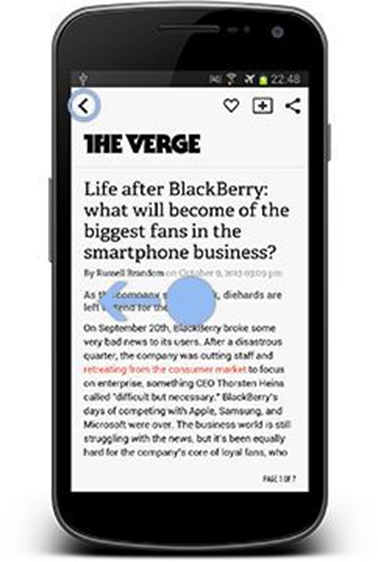
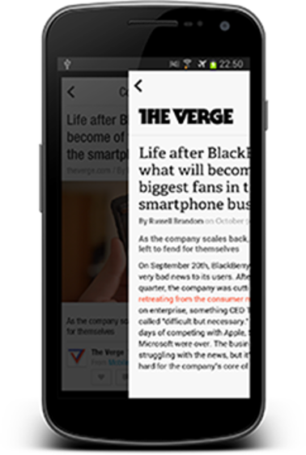

# Házi feladat specifikáció

Információk [itt](https://viaubxav080.github.io/laborok/hf/)

## Haladó Android
### 2024.11.10. - 2024 2. félév
### Illés Ákos - (TK4K29)
### akilevelek@gmail.com

## Bemutatás

Az alkalmazás egy hűtőszekrény applikáció lesz, ezt jobban kifejtve egy az otthon magtalálható ételekről és fűszerekről egy tároló rendszer. Az ötletet az szülte, hogy többször előfordult már velem, hogy a boltban olvasva az ételrecepjét képtelen voltam emlékezni arra, hogy vajon otthon lehet-e az a bizonyos fűszer, amit a recept ír, emiatt vettem még egy csomaggal sokszor feleslegesen, hiszen volt otthon.

## Főbb funkciók

Az alkalmazás lokális adatbázisban fogja tartalmazni az ételeket és fűszereket. Lehet majd keresni az ételek között, hogy azonnal meg lehessen tudni, hogy kell-e olyat venni. Az egyes ételekhez, lehetet majd képet feltölteni, hogy egyértelmű legyen, hogy milyen fajtájú az étel a félreértések elkerülése végett. Az alkalmazás hibamentességét tesztekkel fogom garantálni.

Az alkalmazás minden funkciójára kiterjedő leírás. Legyen egyértelműen eldönthető, hogy az adott funkció implementálva van-e!
P.l.: Az alkalmazással lehetőség van térképen megjeleníteni az állomáspontokat és azok A,B,C,D tulajdonságai meg is jelennek (ha elérhetőek).

## Választott technológiák:

- Room database: Az ételeket a itt fogom tárolni.
- Tesztelés: Tesztelem a kódot.
- Camera API: Az egyes ételekhez így lehet majd képet feltölteni.

___

# Házi feladat dokumentáció

### [Alkalmazás neve]

**Legkésőbb a dokumentáció fázisban lecserélendő a saját ikonnal!**

## Bemutatás

Az alkalmazás rövid, 2-3 mondatos bemutatása. Honnan az ötlet, mi szülte az igényt, ki lehetne a célközönség.
A laboron és előadáson bemutatott alkalmazásokat nem lehet házi feladatnak választani.

## Főbb funkciók

Az alkalmazás minden funkciójára kiterjedő leírás. Legyen egyértelműen eldönthető, hogy az adott funkció implementálva van-e!
P.l.: Az alkalmazással lehetőség van térképen megjeleníteni az állomáspontokat és azok A,B,C,D tulajdonságai meg is jelennek (ha elérhetőek).

## Felhasználói kézikönyv

Az alkalmazás minden funkciójára kiterjedő, teljes körű felhasználói leírás. Az összes releváns képernyőhöz/funkcióhoz tartalmaznia kell képernyőképet!

A képernyőképekkel kapcsolatos követelmények:

- Android Device Art Generator-ral telefont/tabletet kell rajzolni a képernyő köré!
	- Mindegy, hogy melyik készüléket választod, de legyen egységes az egész dokumentumban!
	- Telefonra tervezett képernyőket valamelyik telefon skin-nel, tablet képernyőt (amennyiben készítettél külön) tablet skin-nel készítsünk!
- Álló képernyőket álló módban, fekvőket fekvő módban rakjuk be! (Értelemszerűen. Ha fekvő képernyőképet húzol be a generator-ba, akkor fekvő módban rajzolja köré az eszközt)
-	Minden képhez legyen képaláírás, ami leírja hogy mit kell nézni a képen!
-	A képeket úgy méretezzük, hogy álló telefon méretből kettő elférjen egymás mellett egy sorban (fekvő illetve tablet képeket ehhez viszonyítva nagyítsuk)!
-	Amennyiben gesztúra vezérlést akarunk bemutatni a képernyőn, jelezzük a gesztúrát is! (ld példa kép)
-	A képeket és a képaláírásokat középre igazítsuk!

1. ábra: Gesztúrával és gombbal is navigálható képernyők, hasznos kényelmi funkció a felhasználónak ha több lehetőséget is biztosítunk a navigációra

## Felhasznált technológiák:

Itt kell felsorolni minden technológiát, technikát, külső könyvtárat, komplexebb algoritmust, ami növeli az alkalmazás értékét. Osztályzáskor ezt a fejezetet nézzük meg először.

Külső osztálykönyvtár használata esetén a könyvtár neve legyen link, ami annak elérhetőségére mutat.

A kulcsszavak legyenek **félkövér** betűtípussal szedve.
Például:

- •	Az X és Y képernyők optimalizáltak **álló és fekvő nézetre** is
- [YCharts](https://github.com/yml-org/YCharts) osztálykönyvtár használata a grafikonok rajzolására
- **Fused Location API** használata helymeghatározásra
- **SQLite** alapú adattárolás
- Implicit intent használata **QR kód beolvasáshoz** (telepített Barcode Scanner alkalmazás szükséges a futtatásához)
- A játék fizikáját a [Box2D](https://box2d.org/) motor biztosítja
- **Service** használata zenelejátszáshoz

## Fontosabb technológiai megoldások

**A számodra legnehezebb/legérdekesebb funkciót fejtsd ki kb.  10 mondatban, hogy mi volt a probléma és hogyan oldottad meg.**
